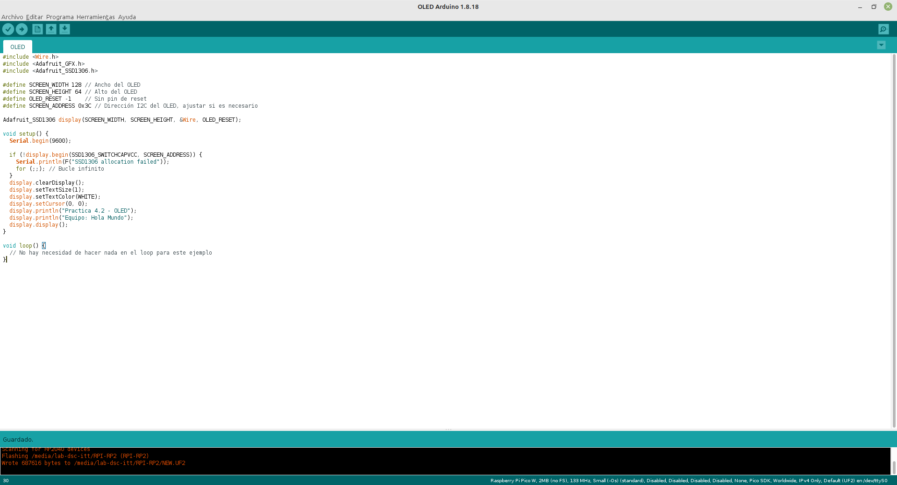
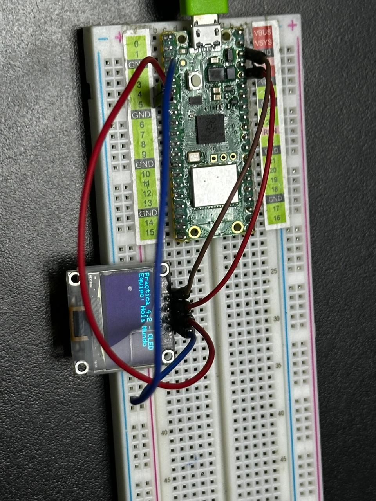
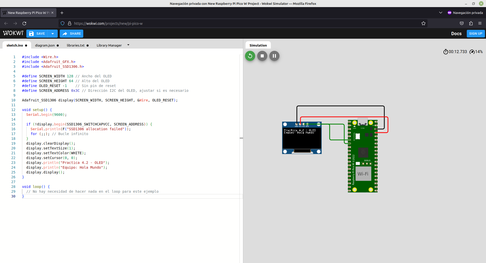

# Practica 2 - OLED

## Código

```c
/*
  Programa: OLED
  Autor: Enrique Barboza, Alejandro Espinoza, Isai Mendoza, Rubén Campos
  Fecha: 13/05/2024

  Descripción:
  Este programa manda el mensaje "Hola Mundo" a una pantalla OLED.

  Licencia: MIT
*/
#include <Wire.h>
#include <Adafruit_GFX.h>
#include <Adafruit_SSD1306.h>

#define SCREEN_WIDTH 128 // Ancho del OLED
#define SCREEN_HEIGHT 64 // Alto del OLED
#define OLED_RESET -1    // Sin pin de reset
#define SCREEN_ADDRESS 0x3C // Dirección I2C del OLED, ajustar si es necesario

Adafruit_SSD1306 display(SCREEN_WIDTH, SCREEN_HEIGHT, &Wire, OLED_RESET);

void setup() {
    Serial.begin(9600);

    if (!display.begin(SSD1306_SWITCHCAPVCC, SCREEN_ADDRESS)) {
        Serial.println(F("SSD1306 allocation failed"));
        for (;;); // Bucle infinito
    }
    display.clearDisplay();
    display.setTextSize(1);
    display.setTextColor(WHITE);
    display.setCursor(0, 0);
    display.println("Practica 4.2 - OLED");
    display.println("Equipo: Hola Mundo");
    display.display();
}

void loop() {
  // No hay necesidad de hacer nada en el loop para este ejemplo
}
```

## Captura del Código



## Captura Ejecución



## Captura del Simulador



## Link al Simulador

[Practica 2 - OLED](https://wokwi.com/projects/398447596235173889)

