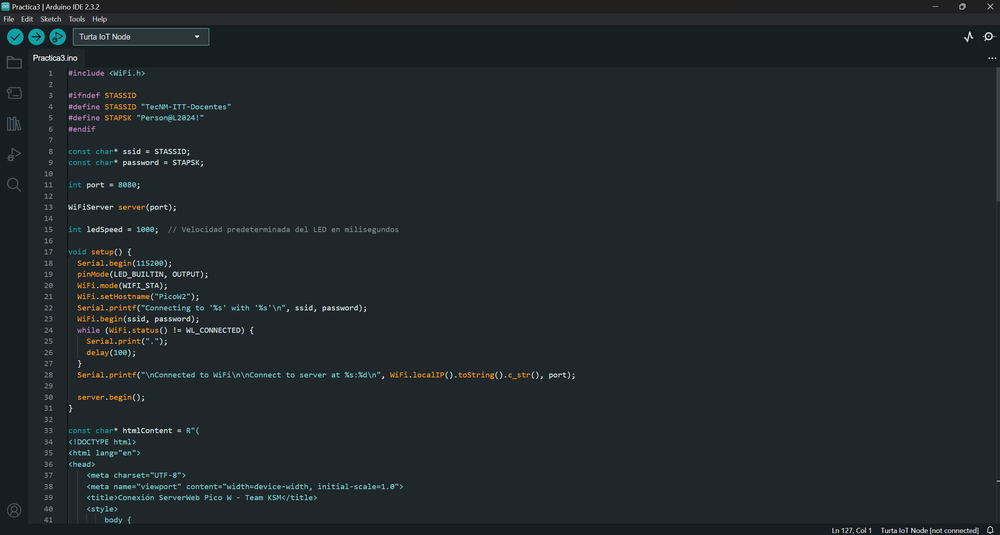
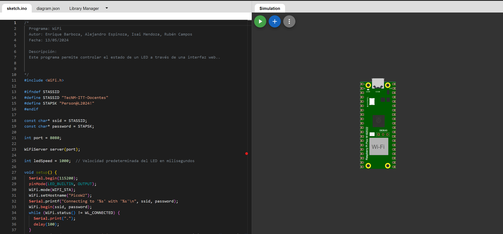

# Practica 3 - WiFi

## Código

```c
/*
  Programa: WiFi
  Autor: Enrique Barboza, Alejandro Espinoza, Isai Mendoza, Rubén Campos
  Fecha: 13/05/2024

  Descripción:
  Este programa permite controlar el estado de un LED a través de una interfaz web..

  
*/
#include <WiFi.h>

#ifndef STASSID
#define STASSID "TecNM-ITT-Docentes"
#define STAPSK "Person@L2024!"
#endif

const char* ssid = STASSID;
const char* password = STAPSK;

int port = 8080;

WiFiServer server(port);

int ledSpeed = 1000;  // Velocidad predeterminada del LED en milisegundos

void setup() {
  Serial.begin(115200);
  pinMode(LED_BUILTIN, OUTPUT);  
  WiFi.mode(WIFI_STA);
  WiFi.setHostname("PicoW2");
  Serial.printf("Connecting to '%s' with '%s'\n", ssid, password);
  WiFi.begin(ssid, password);
  while (WiFi.status() != WL_CONNECTED) {
    Serial.print(".");
    delay(100);
  }
  Serial.printf("\nConnected to WiFi\n\nConnect to server at %s:%d\n", WiFi.localIP().toString().c_str(), port);

  server.begin();
}

const char* htmlContent = R"(
<!DOCTYPE html>
<html lang="en">
<head>
    <meta charset="UTF-8">
    <meta name="viewport" content="width=device-width, initial-scale=1.0">
    <title>Conexión ServerWeb Pico W - Team KSM</title>
    <style>
        body {
            font-family: Arial, sans-serif;
            text-align: center;
            background-color: #2c3e50; /* Color de fondo azul oscuro */
            color: #fff; /* Texto blanco */
            margin: 0;
            padding: 0;
        }
        .container {
            max-width: 600px;
            margin: 50px auto;
            background-color: #34495e; /* Color de fondo azul medio */
            padding: 20px;
            border-radius: 10px;
        }
        h1 {
            color: #2ecc71; /* Color de texto verde para el encabezado */
        }
        p {
            font-size: 18px;
            margin-bottom: 20px;
        }
        button {
            font-size: 16px;
            padding: 10px;
            margin: 10px;
            background-color: #2ecc71; /* Color de fondo verde para el botón */
            color: #fff; /* Texto blanco para el botón */
            border: none;
            cursor: pointer;
            border-radius: 5px;
        }
    </style>
</head>
<body>
    <div class="container">
        <h1>Conexión ServerWeb Pico W - Team KSM</h1>
        <p>Bienvenido a la página de control del LED</p>
        
        <button onclick='toggleLED()'>Encender / Apagar</button>
        <button onclick='setSpeed(500)'>Velocidad Rápida</button>
        <button onclick='setSpeed(1000)'>Velocidad Normal</button>
        <button onclick='setSpeed(2000)'>Velocidad Lenta</button>
    </div>
    <script>
        function toggleLED() {
            // Enviar una solicitud al servidor para controlar el LED
            var xhr = new XMLHttpRequest();
            xhr.open("GET", "/toggle", true);
            xhr.send();
        }
        function setSpeed(speed) {
            // Enviar una solicitud al servidor para ajustar la velocidad del LED
            var xhr = new XMLHttpRequest();
            xhr.open("GET", "/speed?value=" + speed, true);
            xhr.send();
        }
    </script>
</body>
</html>
)";


void loop() {
    WiFiClient client = server.available();
    if (client) {
        Serial.println("Nuevo cliente conectado.");
        String req = client.readStringUntil('\r');
        Serial.println(req);
        client.flush();

        if (req.indexOf("/toggle") != -1) {
            // Si la solicitud contiene "/toggle", cambia el estado del LED
            digitalWrite(LED_BUILTIN, !digitalRead(LED_BUILTIN));
        } else if (req.indexOf("/speed") != -1) {
            // Si la solicitud contiene "/speed", ajusta la velocidad del LED
            int pos = req.indexOf("value=");
            if (pos != -1) {
                ledSpeed = req.substring(pos + 6).toInt();
            }
        }

        client.println("HTTP/1.1 200 OK");
        client.println("Content-Type: text/html");
        client.println("Connection: close");
        client.println();

        // Aquí enviamos el contenido HTML
        client.print(htmlContent);

        client.stop();
        Serial.println("Cliente desconectado.");
    }
    digitalWrite(LED_BUILTIN, HIGH);
    delay(ledSpeed);
    digitalWrite(LED_BUILTIN, LOW);
    delay(ledSpeed);
}

```

## Captura del Código




## Captura del Simulador



## Link al Simulador

[Practica 3 - WiFi](https://wokwi.com/projects/398535250757706753)
